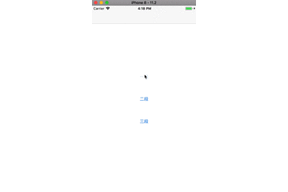

# XCDropdownSegment


[](https://travis-ci.org/fanxiaocong/XCDropdownSegment)
[](https://cocoapods.org/pods/XCDropdownSegment)
[](https://cocoapods.org/pods/XCDropdownSegment)
[](https://cocoapods.org/pods/XCPresentation)
[](https://www.apple.com/nl/ios/)&nbsp;

***
|Author|小小聪明屋|
|---|---|
|E-mail|1016697223@qq.com|
|GitHub|https://github.com/fanxiaocong|
|Blog|http://www.cnblogs.com/fanxiaocong|
***


## Example
简单封装的下拉列表，支持多段显示




### 代码

#### 创建视图

```objc
XCDropdownSegment *segment = [[XCDropdownSegment alloc] initWithFrame:CGRectMake(0, 64, SCREEN_WIDTH, SCREEN_HEIGHT-64)];
segment.dataSource = self;
segment.delegate   = self;
[self.view addSubview:segment];
    
if (1 == self.sectionCount)
{
    [segment updateConfigure:^(XCDropdownSegmentConfigure *confi) {
        confi.headerSelectedTitleColor = [UIColor redColor];
        confi.rowHeight = 40;
    }];
}
```

</br>

#### `<XCDropdownSegmentDataSource.h>`&nbsp;数据源方法

`- (NSArray<NSString *> *)titlesOfHeaderInDropdownSegment:(XCDropdownSegment *)dropdownSegment`

段头标题显示的文字，可以是多段，需要一个数组返回

```objc
- (NSArray<NSString *> *)titlesOfHeaderInDropdownSegment:(XCDropdownSegment *)dropdownSegment
{
	return @[@"第一段", @"第二段", @"第三段"];
}
```
</br>
`- (NSArray<NSString *> *)dropdownSegment:(XCDropdownSegment *)dropdownSegment titlesInSection:(NSInteger)section`

每段显示的文字数组，可以根据不同的 `section` 来返回不同的内容

```objc
- (NSArray<NSString *> *)dropdownSegment:(XCDropdownSegment *)dropdownSegment titlesInSection:(NSInteger)section
{
    return @[
             @"三：001",
             @"三：002",
             @"三：003",
             @"三：004",
             @"三：005"
             ];
}
```
</br>
#### `<XCDropdownSegmentDelegate.h>`&nbsp;代理方法

`- (void)dropdownSegment:(XCDropdownSegment *)dropdownSegment
    didSelectHeaderInSection:(NSInteger)section`

点击第 section 段的头部的回调

</br>
`- (void)dropdownSegment:(XCDropdownSegment *)dropdownSegment didSelectRow:(NSInteger)row inSection:(NSInteger)section`

点击第 section 段的第 row 行的回调


## Installation

### CocoaPods
```objc
pod 'XCDropdownSegment'
```